# hse_hw3_chromhmm

Ссылка на [Google Colab](https://colab.research.google.com/drive/1LyUznbDUSu8_IxyuRobBwb9Qk4I8vlF8?usp=sharing)

## Часть 1

#### Клеточная линия -  NHEK ( GM23248 не нашлось )


### Список гистоновых меток

|Гистоновая метка|                           Имя файла                                 |
:--------------:|:------------------------------------------------------------:
H3K27ac         |  wgEncodeBroadHistone/wgEncodeBroadHistoneNhekH3k27acStdAlnRep1.bam 
H3K27me3        |  wgEncodeBroadHistone/wgEncodeBroadHistoneNhekH3k27me3StdAlnRep1.bam
H3K36me3        |  wgEncodeBroadHistone/wgEncodeBroadHistoneNhekH3k36me3StdAlnRep1.bam
H3k4me1         |  wgEncodeBroadHistone/wgEncodeBroadHistoneNhekH3k4me1StdAlnRep1.bam 
H3K4me2         |  wgEncodeBroadHistone/wgEncodeBroadHistoneNhekH3k4me2StdAlnRep1.bam 
H3k4me3         |  wgEncodeBroadHistone/wgEncodeBroadHistoneNhekH3k4me3StdAlnRep1.bam 
H3K79me2        |  wgEncodeBroadHistone/wgEncodeBroadHistoneNhekH3k79me2AlnRep1.bam   
H3K9ac          |  wgEncodeBroadHistone/wgEncodeBroadHistoneNhekH3k9acStdAlnRep1.bam  
H3K9me1         |  wgEncodeBroadHistone/wgEncodeBroadHistoneNhekH3k9me1StdAlnRep1.bam 
H4k20me1        |  wgEncodeBroadHistone/wgEncodeBroadHistoneNhekH4k20me1StdAlnRep1.bam

NhekControl  - wgEncodeBroadHistone/wgEncodeBroadHistoneNhekControlStdAlnRep1.bam


### ChromHMM

| transitions          |  Emission | overlap|
:-------------------------:|:-------------------------:|:-------------------------:
  |  |

| RefSeqTSS           | RefSeqTES |
:-------------------------:|:-------------------------:
|  


### Таблица c обозначениями эпигенетических типов:

|Состояние|Эпигенетический тип|Встречаемость в гистоновых модификациях|Описание|Изображение из USCC|
|----|-----|-------|------|------|
|1 |Heterochromatin|Не встречается |<ul><li>Данное состояние нe попало на ген.<li>Показывает низкий сигнал.<li>Подает на участок репрессированного гетерохроматима.<li>Чаще всего ассоциировано с:<ul><li> Genome <li> laminB1lads| 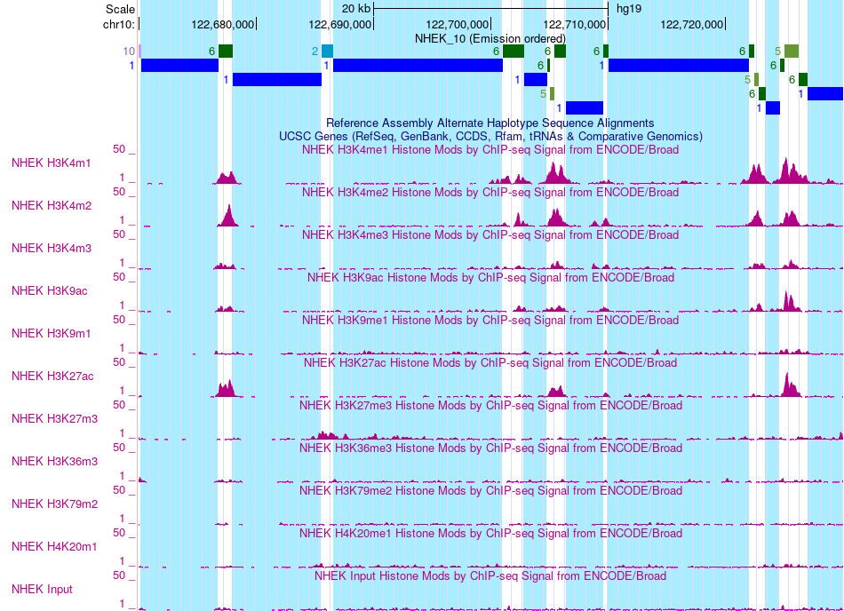 |
|2 |Heterochromatin|Почти не встречается, кроме <ul><li>H3K27me3|<ul><li>Показывает низкий сигнал<li>Подает на участок репрессированного гетерохроматима. <li>Чаще всего ассоциировано с: <ul><li>laminB1lads  <li>RefSeqTES <li>RefSeqExon|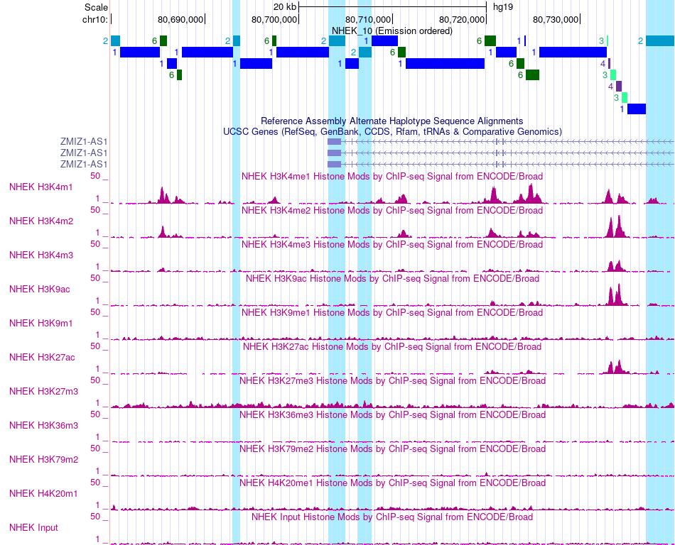 |
|3 |Enhancer|Во всех, но чаще всего в: <ul><li> H3k4me3 <li> H3k4me2 <li> H3K27me3  <li> H3K9ac <li> H3k4me1|<ul><li>Данное состояние попадает на интрон<li>Показывает высокий сигнал<li>Чаще всего ассоциировано с: <ul><li>CpGIsland <li>RefSeqTSS <li>RefSeqExon <li>RefSeqTSS2kb <li>RefSeqTES|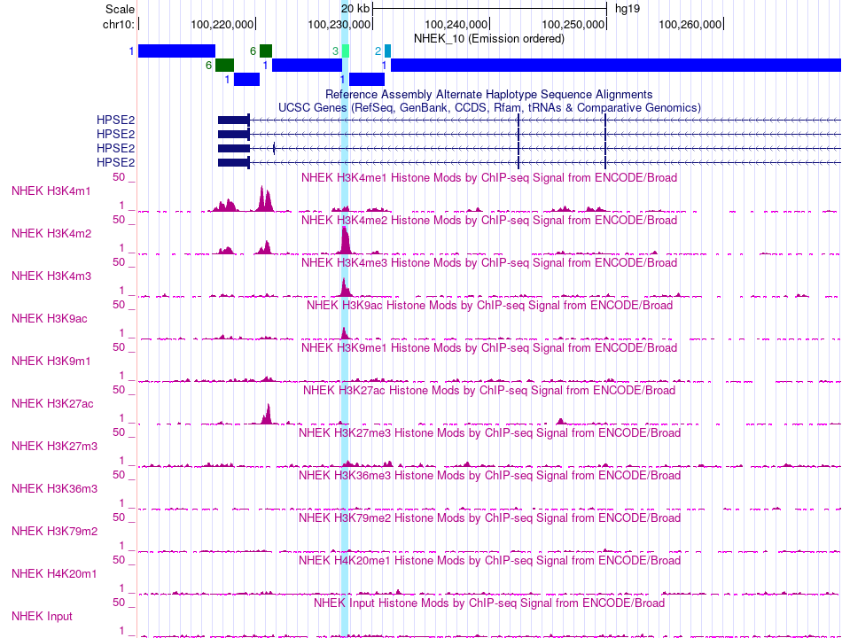 |
|4 |Enhancer|Почти во всех, но чаще всего в: <ul><li> H3k4me3 <li> H3K9ac <li> H3K27ac  <li> H3k4me2 <li> H3K79me2 |<ul><li>Данное состояние попадает на интрон<li>Показывает высокий сигнал <li>Чаще всего ассоциировано с: <ul><li>CpGIsland <li>RefSeqExon <li>RefSeqTSS <li>RefSeqTSS2kb <li>RefSeqTES|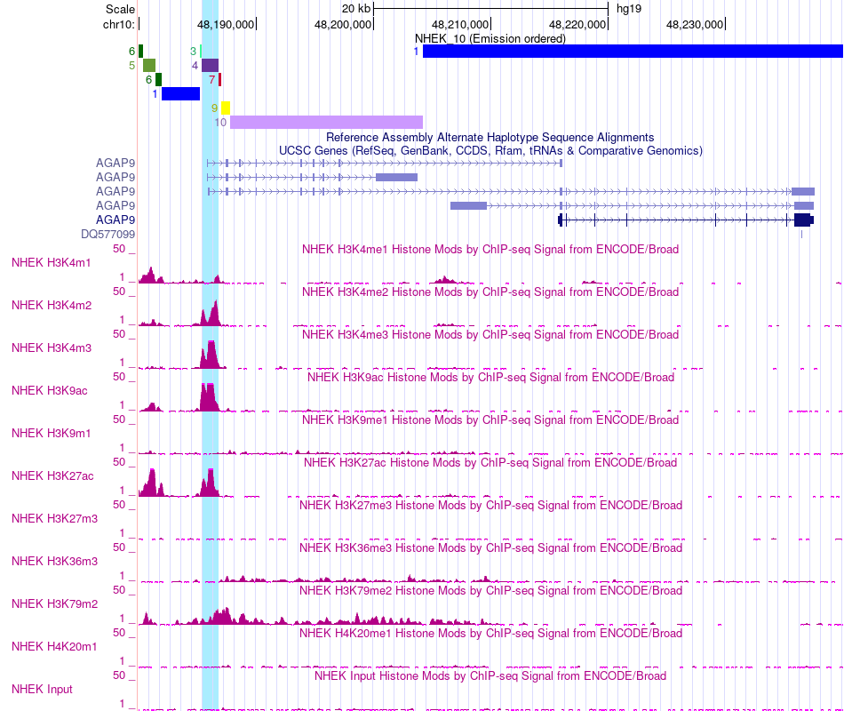 |
|5 |Repressed|Почти во всех, но чаще всего в: <ul><li> H3K27ac <li> H3k4me2<li> H3k4me1 <li> H3K9ac  |<ul><li>Данное состояние нe попало на ген.<li>Показывает высокий сигнал <li>Чаще всего ассоциировано с: <ul><li>RefSeqTES <li>laminB1lads|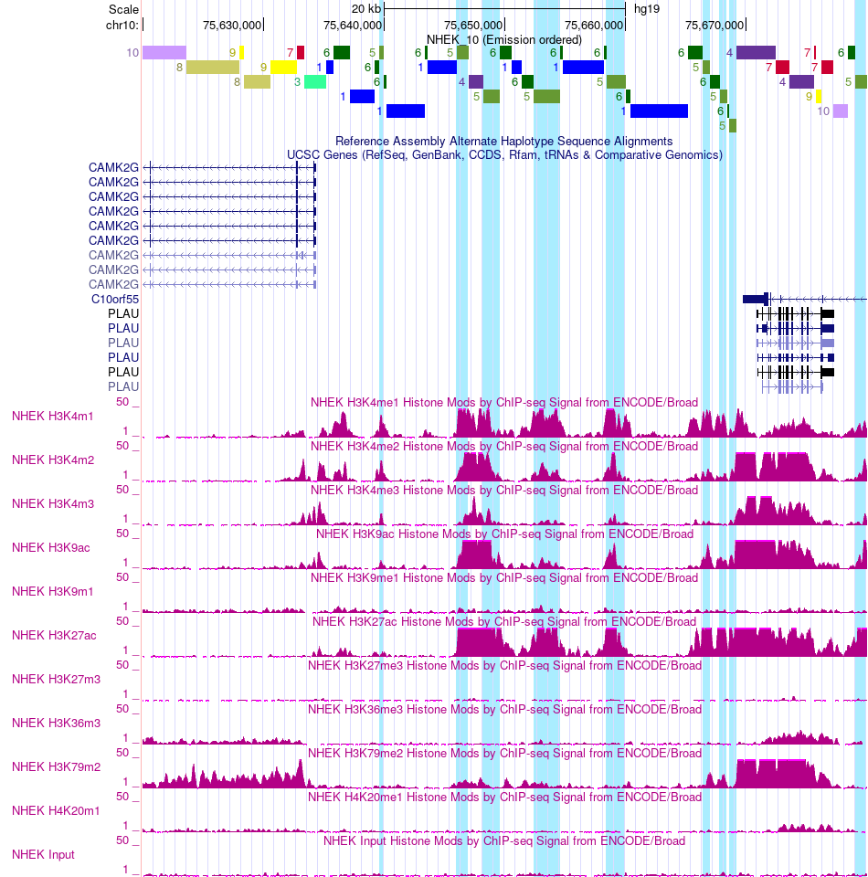 |
|6 |Repressed|Во многих, но чаще всего в:  <ul><li>H3k4me1  <li>H3k4me2 <li>H3K27ac |<ul><li>Данное состояние нe попало на ген или попало на интрон.<li>Чаще всего ассоциировано с: <ul><li>laminB1lads <li>RefSeqTES|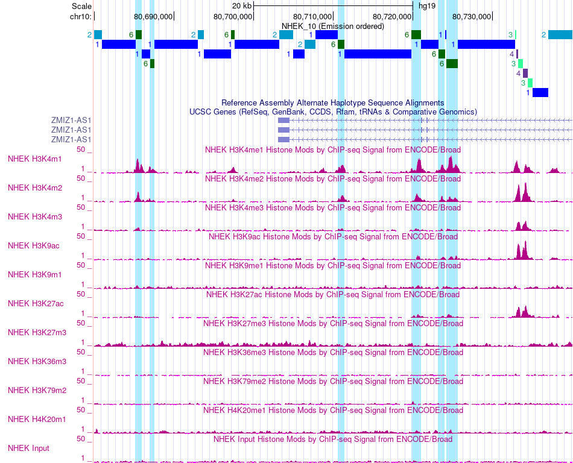 |
|7 |Enhancer|Почти во всех, но чаще всего в: <ul><li>H3k4me1  <li>H3k4me2 <li>H3K79me2  <li>H3K27ac  |<ul<li>Данное состояние попадает на интрон<li>Чаще всего ассоциировано с: <ul><li>RefSeqGene <li>RefSeqTES|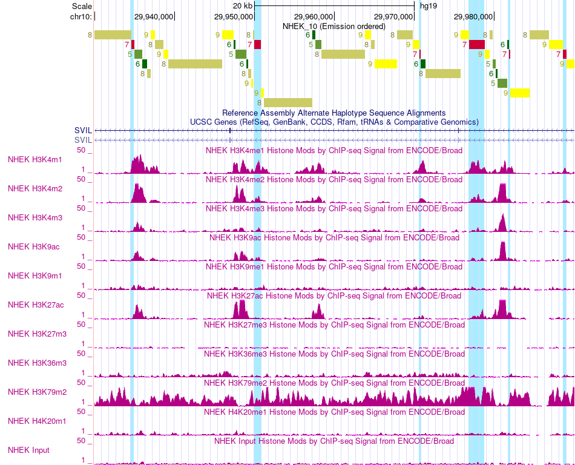 |
|8 |Transcribed|Почти не встречается, кроме: <ul><li>H3K79me2 |<ul><li>Данное состояние попадает на интрон<li>Имеет очень низкую активность, но попадает на ген=> транскрибируемый участок гена.<li>Показывает низкий сигнал <li>Чаще всего ассоциировано с: <ul><li>RefSeqGene|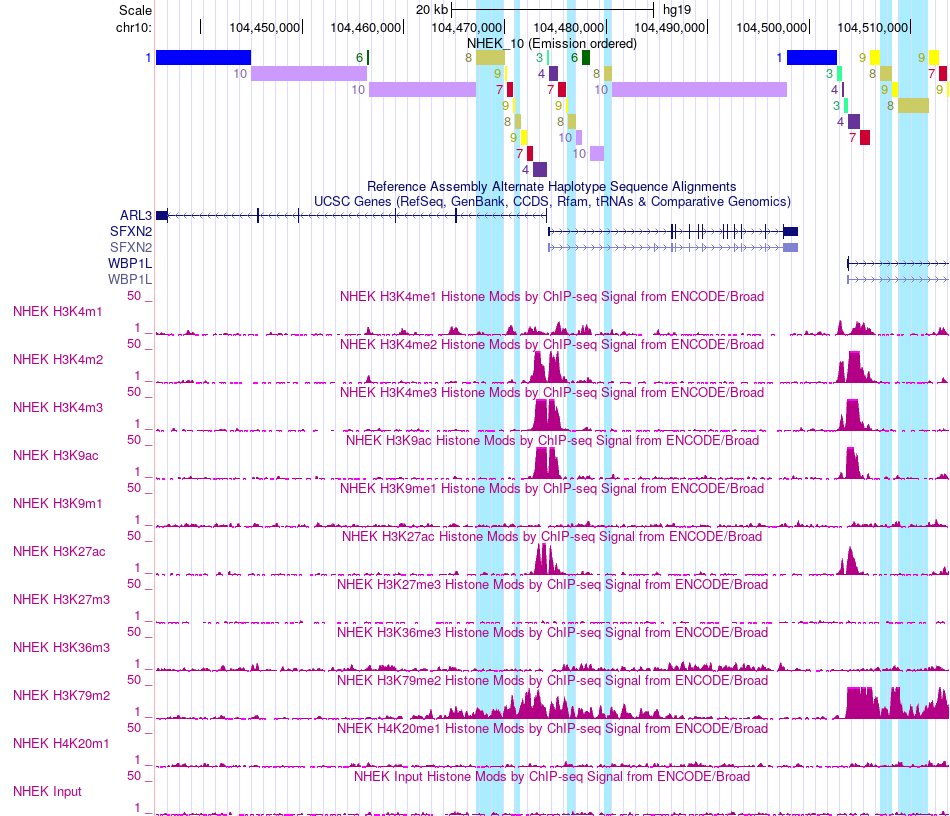 |
|9 |Transcribed|Почти не встречается, кроме: <ul><li>H3K79me2 <li>H3K36me3|<ul><li>Имеет очень низкую активность, но попадает на ген => транскрибируемый участок гена.<li>Чаще всего ассоциировано с: <ul><ul><li>RefSeqGene|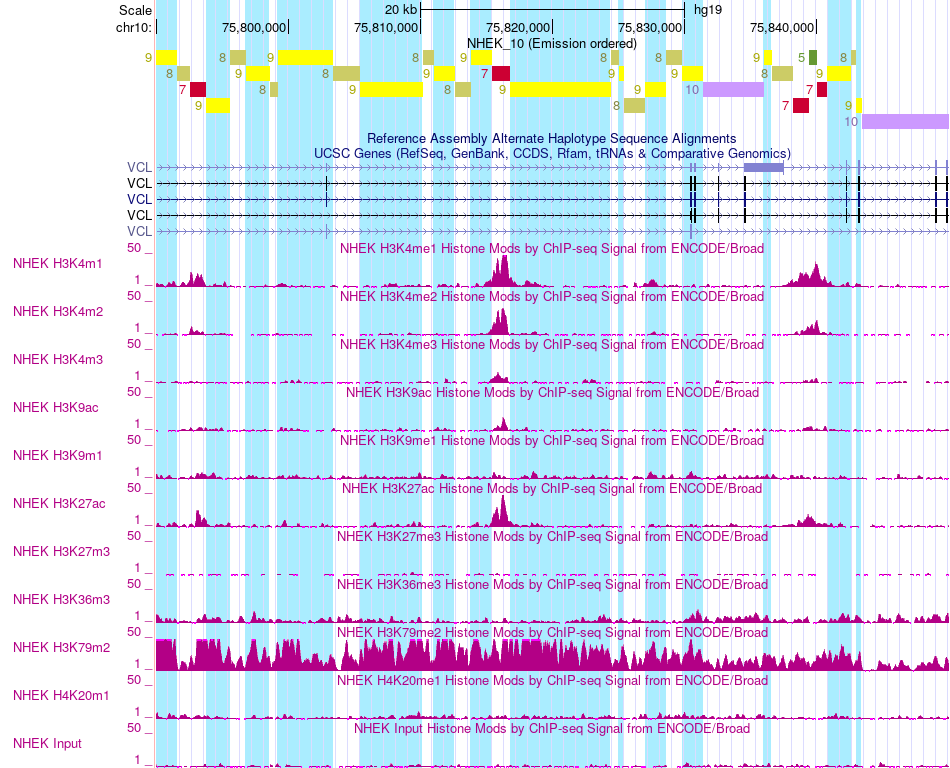 |
|10 |Transcribed|Почти не встречается, кроме: <ul><li>H3K36me3 |<ul><li>Имеет очень низкую активность, но попадает на ген => транскрибируемый участок гена.<li>Показывает низкий сигнал <li>Чаще всего ассоциировано с: <ul><li>RefSeqExon <li>RefSeqGene <li>RefSeqTES|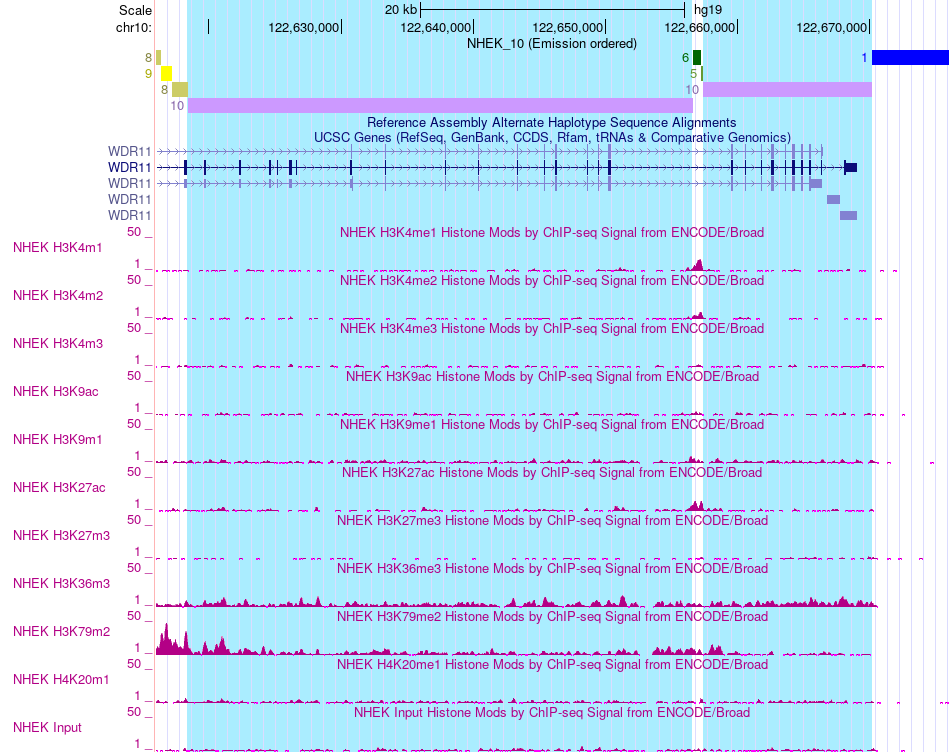 |
  
  
  
### Команды 
### Создание файла cellmarkfiletable.txt
```python
import os
control = 'Control.bam'
with open(f'cellmarkfiletable.txt', 'a') as the_file:
  for file in os.listdir():
    if file[-3:] == 'bam' and "Control" not in file:
      the_file.write(f'NHEK\t{file[:-4]}\t{file}\t{control}\n')
```
### Binarize Bam
```python
!java -mx5000M -jar /content/ChromHMM/ChromHMM.jar BinarizeBam -b 200  /content/ChromHMM/CHROMSIZES/hg19.txt /content/ cellmarkfiletable.txt   binarizedData
```
### Learn Module
```python
!java -mx5000M -jar /content/ChromHMM/ChromHMM.jar LearnModel  -b 200 /content/binarizedData/ /content/learnData 10 hg19
```
  
### Бонус
```python
types = ['Heterochromatin', 'Heterochromatin', 'Enhancer', 'Enhancer', 'Repressed', 'Repressed', 'Enhancer', 'Transcribed', 'Transcribed', 'Transcribed']
with open(f'learnData/NHEK_10_dense.bed', 'r') as f:
  with open(f'learnData/NHEK_10_dense_new.bed', 'a') as f_new:
    lines = f.readlines()
    flag = True
    for line in lines:
      if flag:
        flag = False
        f_new.write(line)
      else:
        arr = line.split('\t')
        arr[3] = arr[3]+'_'+types[int(arr[3])-1]
        f_new.write('\t'.join(arr))
```
  
 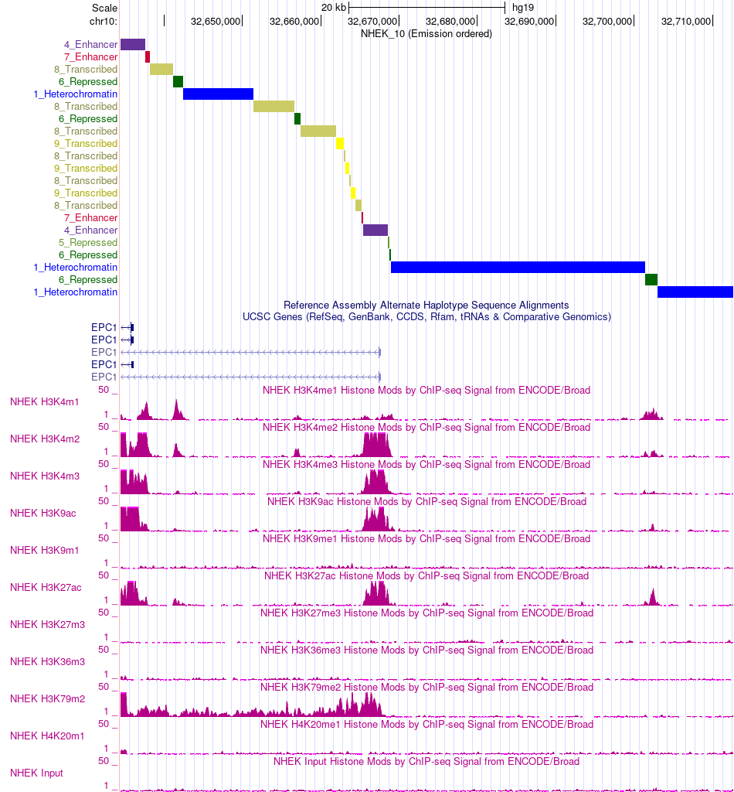

  
