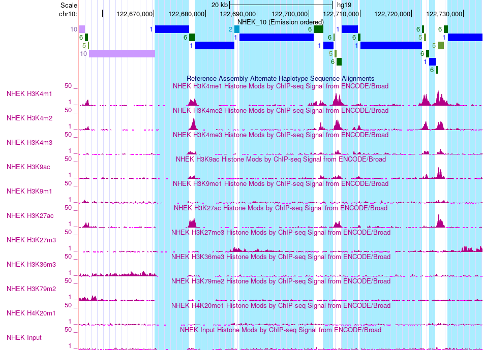
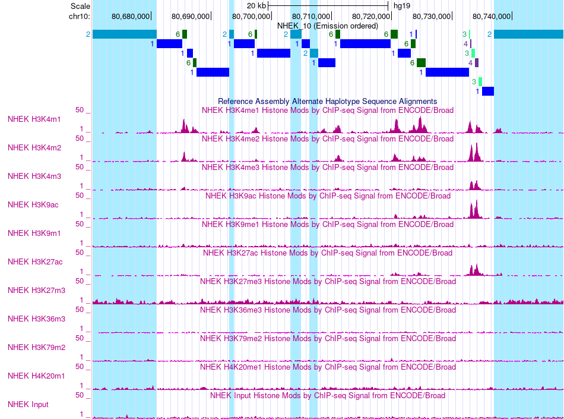
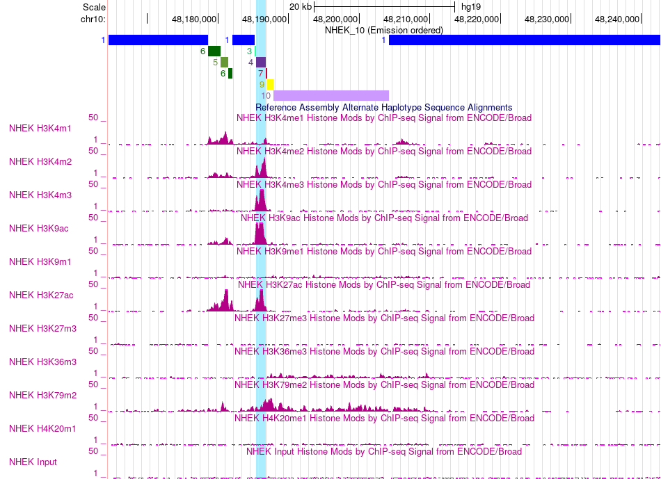
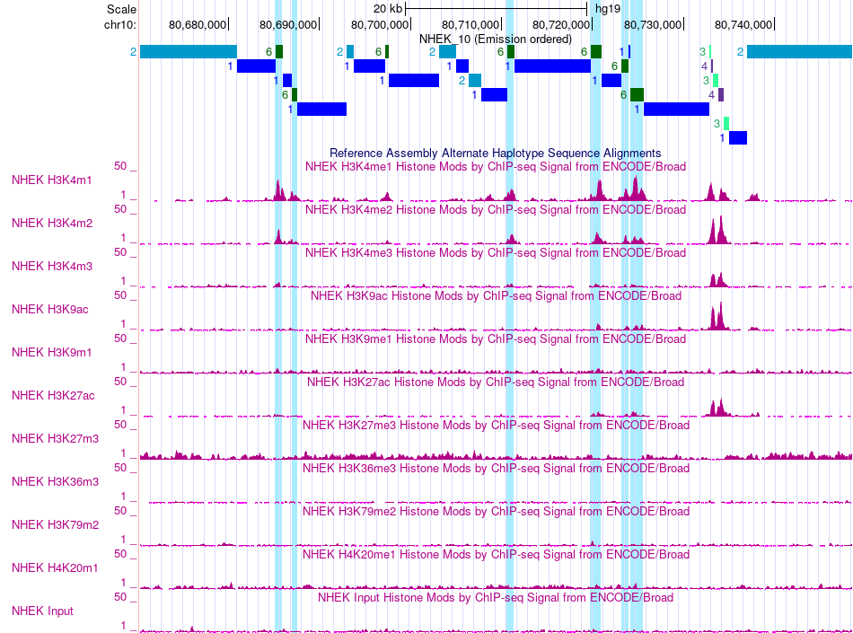
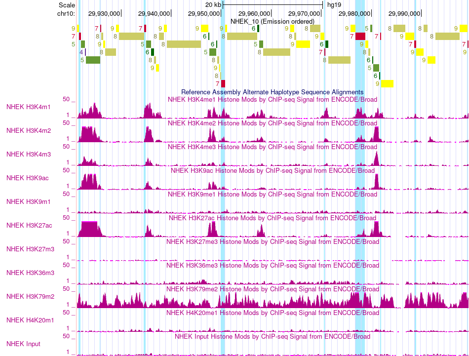
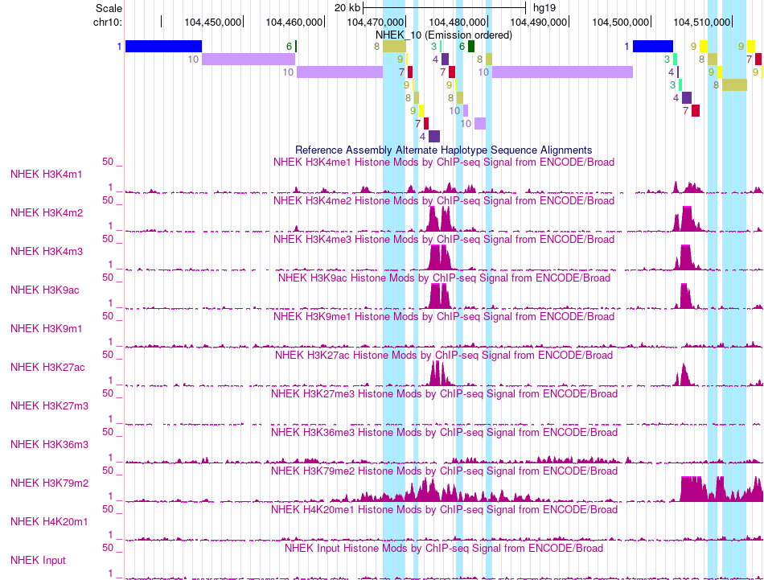
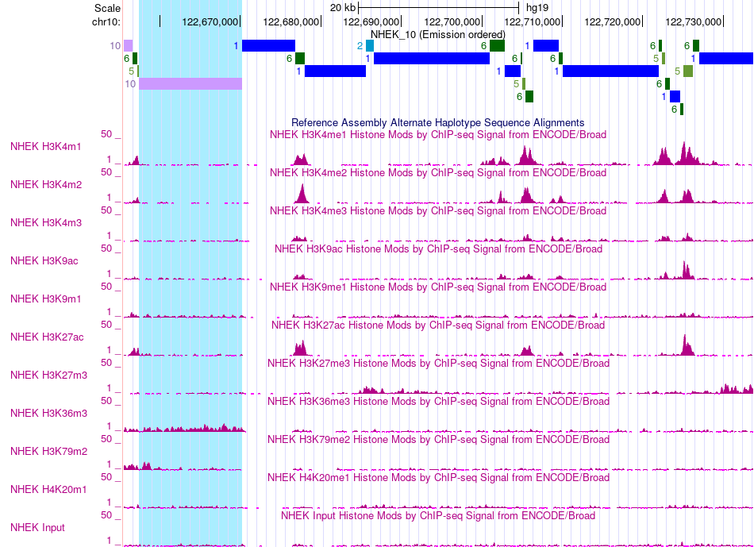

# hse_hw3_chromhmm

## Часть 1

#### Клеточная линия -  NHEK ( GM23248 не нашлось )

### Список гистоновых меток

|Гистоновая метка|                           Имя файла                                 |
:--------------:|:------------------------------------------------------------:
H3K27ac         |  wgEncodeBroadHistone/wgEncodeBroadHistoneNhekH3k27acStdAlnRep1.bam 
H3K27me3        |  wgEncodeBroadHistone/wgEncodeBroadHistoneNhekH3k27me3StdAlnRep1.bam
H3K36me3        |  wgEncodeBroadHistone/wgEncodeBroadHistoneNhekH3k36me3StdAlnRep1.bam
H3k4me1         |  wgEncodeBroadHistone/wgEncodeBroadHistoneNhekH3k4me1StdAlnRep1.bam 
H3K4me2         |  wgEncodeBroadHistone/wgEncodeBroadHistoneNhekH3k4me2StdAlnRep1.bam 
H3k4me3         |  wgEncodeBroadHistone/wgEncodeBroadHistoneNhekH3k4me3StdAlnRep1.bam 
H3K79me2        |  wgEncodeBroadHistone/wgEncodeBroadHistoneNhekH3k79me2AlnRep1.bam   
H3K9ac          |  wgEncodeBroadHistone/wgEncodeBroadHistoneNhekH3k9acStdAlnRep1.bam  
H3K9me1         |  wgEncodeBroadHistone/wgEncodeBroadHistoneNhekH3k9me1StdAlnRep1.bam 
H4k20me1        |  wgEncodeBroadHistone/wgEncodeBroadHistoneNhekH4k20me1StdAlnRep1.bam

NhekControl  - wgEncodeBroadHistone/wgEncodeBroadHistoneNhekControlStdAlnRep1.bam

### ChromHMM

| transitions          |  Emission | overlap|
:-------------------------:|:-------------------------:|:-------------------------:
  |  |

| RefSeqTSS           | RefSeqTES |
:-------------------------:|:-------------------------:
|  

### Таблица c обозначениями эпигенетических типов:

|Состояние|Эпигенетический тип|Встречаемость в гистоновых модификациях|Описание|Изображение из USCC|
|----|-----|-------|------|------|
|1 |   |Не встречается |<ul><li>Чаще всего ассоциировано с ядерной ламиной, то есть попаает на участок репрессированного гетерохроматима.<li>Показывает низкий сигнал <li>Чаще всего ассоциировано с:<ul><li> Genome <li> laminB1lads|  |
|2 |   |Почти не встречается, кроме <ul><li>H3K27me3|<ul><li>Показывает низкий сигнал <li>Чаще всего ассоциировано с: <ul><li>laminB1lads  <li>RefSeqTES <li>RefSeqExon | |
|3 |   |Во всех, но чаще всего в: <ul><li> H3k4me3 <li> H3k4me2 <li> H3K27me3  <li> H3K9ac <li> H3k4me1|Чаще всего ассоциировано с: <ul><li>CpGIsland <li>RefSeqTSS <li>RefSeqExon <li>RefSeqTSS2kb <li>RefSeqTES| |
|4 |   |Почти во всех, но чаще всего в: <ul><li> H3k4me3 <li> H3K9ac <li> H3K27ac  <li> H3k4me2 <li> H3K79me2 |<ul><li>Показывает высокий сигнал <li>Чаще всего ассоциировано с: <ul><li>CpGIsland <li>RefSeqExon <li>RefSeqTSS <li>RefSeqTSS2kb <li>RefSeqTES| |
|5 |   |Почти во всех, но чаще всего в: <ul><li> H3K27ac <li> H3k4me2<li> H3k4me1 <li> H3K9ac  |<ul><li>Показывает высокий сигнал <li>Чаще всего ассоциировано с: <ul><li>RefSeqTES <li>laminB1lads| |
|6 |   |Во многих, но чаще всего в:  <ul><li>H3k4me1  <li>H3k4me2 <li>H3K27ac |Чаще всего ассоциировано с: <ul><li>laminB1lads <li>RefSeqTES| |
|7 |   |Почти во всех, но чаще всего в: <ul><li>H3k4me1  <li>H3k4me2 <li>H3K79me2  <li>H3K27ac  |Чаще всего ассоциировано с: <ul><li>RefSeqGene <li>RefSeqTES| |
|8 |   |Почти не встречается, кроме: <ul><li>H3K79me2 |<ul><li>Показывает низкий сигнал <li>Чаще всего ассоциировано с: <ul><li>RefSeqGene| |
|9 |   |Почти не встречается, кроме: <ul><li>H3K79me2 <li>H3K36me3|Чаще всего ассоциировано с: <ul><li>RefSeqGene| |
|10 |  |Почти не встречается, кроме: <ul><li>H3K36me3 |<ul><li>Показывает низкий сигнал <li>Чаще всего ассоциировано с: <ul><li>RefSeqExon <li>RefSeqGene <li>RefSeqTES| |
