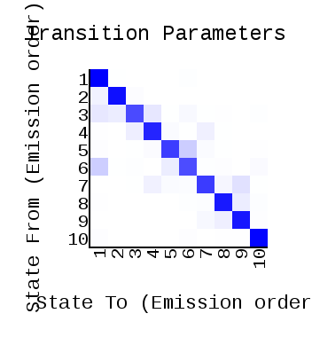
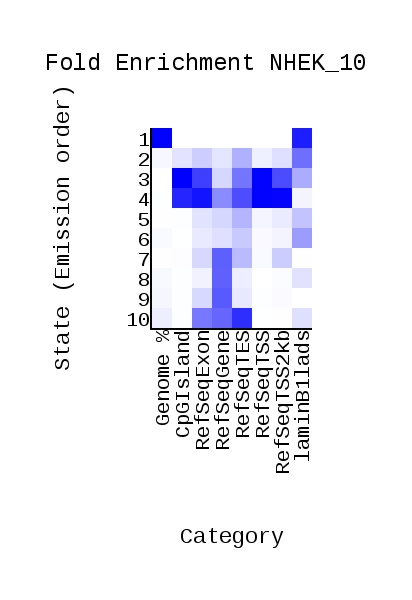
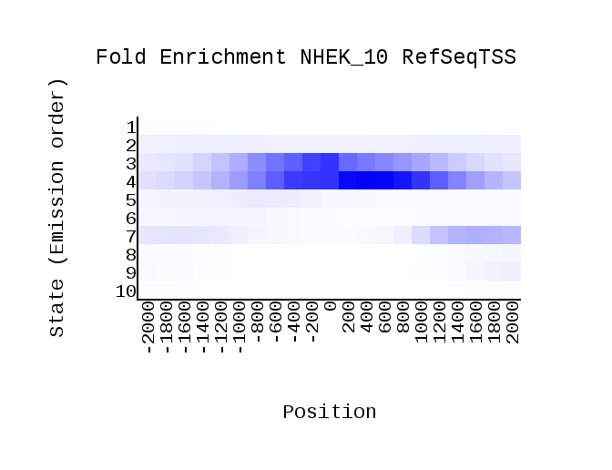

# hse_hw3_chromhmm

## Часть 1

#### Клеточная линия -  NHEK ( GM23248 не нашлось )

### Список гистоновых меток

|Гистоновая метка|                                                     Ссылка                                                                   |
| -------------- |:----------------------------------------------------------------------------------------------------------------------------:|
|H3K27ac         |  http://hgdownload.cse.ucsc.edu/goldenPath/hg19/encodeDCC/wgEncodeBroadHistone/wgEncodeBroadHistoneNhekH3k27acStdAlnRep1.bam |
|H3K27me3        |  http://hgdownload.cse.ucsc.edu/goldenPath/hg19/encodeDCC/wgEncodeBroadHistone/wgEncodeBroadHistoneNhekH3k27me3StdAlnRep1.bam|
|H3K36me3        |  http://hgdownload.cse.ucsc.edu/goldenPath/hg19/encodeDCC/wgEncodeBroadHistone/wgEncodeBroadHistoneNhekH3k36me3StdAlnRep1.bam|
|H3k4me1         |  http://hgdownload.cse.ucsc.edu/goldenPath/hg19/encodeDCC/wgEncodeBroadHistone/wgEncodeBroadHistoneNhekH3k4me1StdAlnRep1.bam |
|H3K4me2         |  http://hgdownload.cse.ucsc.edu/goldenPath/hg19/encodeDCC/wgEncodeBroadHistone/wgEncodeBroadHistoneNhekH3k4me2StdAlnRep1.bam |
|H3k4me3         |  http://hgdownload.cse.ucsc.edu/goldenPath/hg19/encodeDCC/wgEncodeBroadHistone/wgEncodeBroadHistoneNhekH3k4me3StdAlnRep1.bam |
|H3K79me2        |  http://hgdownload.cse.ucsc.edu/goldenPath/hg19/encodeDCC/wgEncodeBroadHistone/wgEncodeBroadHistoneNhekH3k79me2AlnRep1.bam   |
|H3K9ac          |  http://hgdownload.cse.ucsc.edu/goldenPath/hg19/encodeDCC/wgEncodeBroadHistone/wgEncodeBroadHistoneNhekH3k9acStdAlnRep1.bam  |
|H3K9me1         |  http://hgdownload.cse.ucsc.edu/goldenPath/hg19/encodeDCC/wgEncodeBroadHistone/wgEncodeBroadHistoneNhekH3k9me1StdAlnRep1.bam |
|H4k20me1        |  http://hgdownload.cse.ucsc.edu/goldenPath/hg19/encodeDCC/wgEncodeBroadHistone/wgEncodeBroadHistoneNhekH4k20me1StdAlnRep1.bam|

NhekControl  - http://hgdownload.cse.ucsc.edu/goldenPath/hg19/encodeDCC/wgEncodeBroadHistone/wgEncodeBroadHistoneNhekControlStdAlnRep1.bam

### ChromHMM

| transitions          |  Emission | overlap|
:-------------------------:|:-------------------------:|:-------------------------:
  |  |

| RefSeqTSS           | RefSeqTES |
:-------------------------:|:-------------------------:
|  
